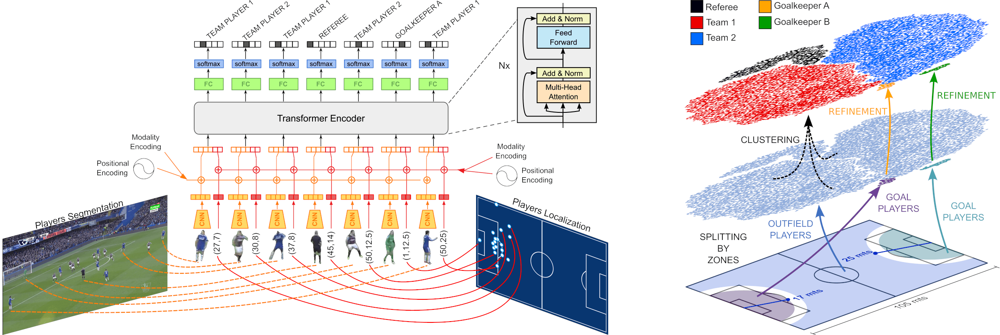

# Player Classification

This repository contains the code for our two soccer player classification methods.

<p align="center" float="left">
  
</p>

The repository includes:
* Source code for training the models
* Training/testing code for SoccerNet-V2

The code is documented and designed to be easy to extend. If you use it in your research, please consider citing this repository (bibtex below).

## ⚽ Requirements
Python 3.9, PyTorch 1.12.1, and other common packages listed in `environment.yml`. (A Conda environment can be created from it following the instructions below.)

### SoccerNet Requirements:

To train or test on SoccerNet V2 and V3, you'll also need:
* [SoccerNet Dataset](https://soccer-net.org/)

## ⚽ Setup

1. Clone this repository:

```shell
git clone https://github.com/gorayni/player_classification
```

2. Create and initialize a conda environment:

```shell
cd player_classification
conda env create --name player --file environment.yml
conda activate player
```

NOTE: Another way to create the conda environment is to run the `conda_environment.sh` file.

3. Link the SoccerNet dataset inside the `datasets` directory:

```shell
ln -s /path/to/soccernet data/soccernet
```

## ⚽ Training/Testing

After activating the conda environment described in the setup section you can train/test the network as follows:

#### Backbone CNN

The backbone network is trained on patches obtained in an unsupervised way using metric learning.

```shell
python main.py -c config/transformer.json -a backbone --m data/train_v2.csv
```

#### Clustering

Labels for unseen matches are obtained by clustering their embeddings from the backbone network.

```shell
python main.py -c config/transformer.json --cluster --sequences data/snv3_matches.json -b weights/backbone.pth
python main.py -c config/transformer.json --cluster -m sandbox.csv -b weights/backbone.pth
```

#### Transformer

After obtaining the labels through clustering the embeddings of the backbone network, the transformer is trained by:

```shell
python main.py -c config/transformer.json -a transformer --sequences data/snv3_matches.json -b weights/backbone.pth
```

Training a single transformer:

```shell
python main.py -c config/transformer_snv2.json -a transformer -s data/splits_v2.json -b weights/backbone.pth
```

## ⚽ Testing Previous Methods

```shell
python main.py -c config/cnn.json -a cnn -m data/test_v2.csv
```

## Citation

If you use this code, please cite the following paper:

Alejandro Cartas, Coloma Ballester, and Gloria Haro. "Two Weakly Supervised Approaches for Role Classification of Soccer Players" ACM MMSports Workshop (2024).

```
@inproceedings{cartas2024PlayerClassification,
author = {Cartas, Alejandro and Ballester, Coloma and Haro, Gloria},
title = {Two Weakly Supervised Approaches for Role Classification of Soccer Players},
publisher = {Association for Computing Machinery},
address = {New York, NY, USA},
booktitle = {Proceedings of the 7th International ACM Workshop on Multimedia Content Analysis in Sports},
series = {MMSports '24}
location = {Melbourne, Australia},
year = {2024},
}
```

## Acknowledgements

This project is a collaboration effort between MOG Technologies and the Universitat Pompeu Fabra. The authors acknowledge support by MICINN/FEDER UE project, ref. PID2021-127643NB-I00, and the support of the European Commission, Horizon Europe Programme, EMERALD Project 101119800.

<p align="center" float="left">
  &nbsp;&nbsp;
  
</p>